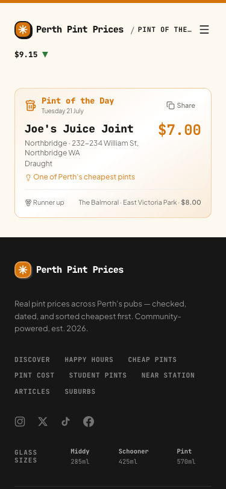
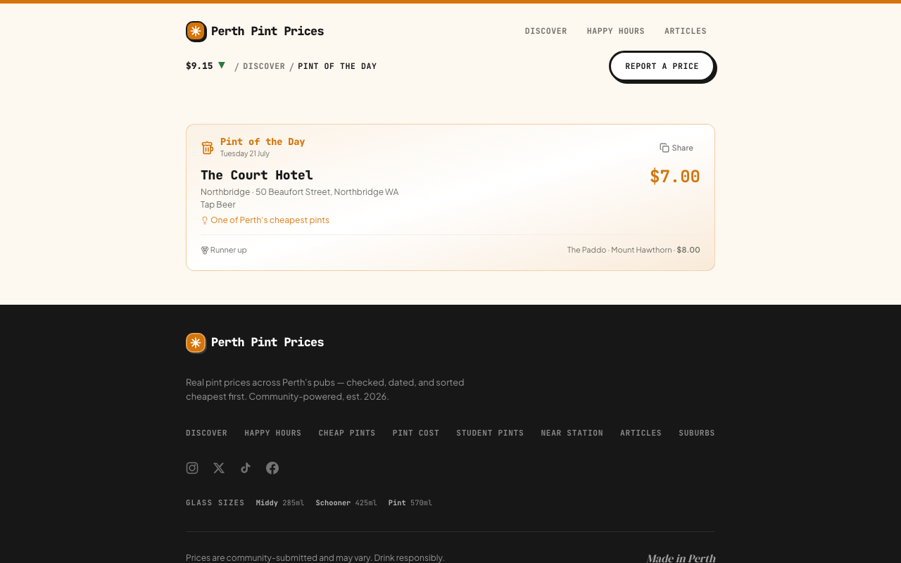
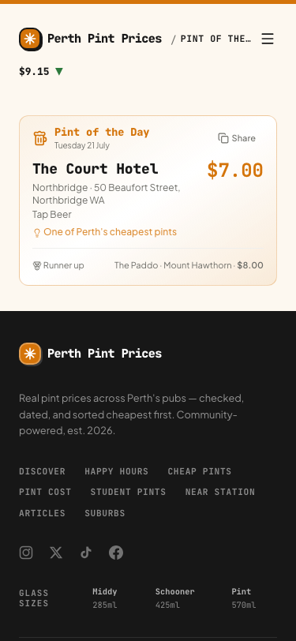

# Pint of the Day SSR evidence — issue #234

Captured 21 July 2026 (Australia/Perth).

## Before: current production

Desktop viewport, 1280×800:

Mobile viewport, 375×812:

The hydrated production page selected Joe's Juice Joint, with The Balmoral as runner-up.

## After: PR branch production server

Desktop viewport, 1280×800:

Mobile viewport, 375×812:

The PR branch selected The Court Hotel, with The Paddo as runner-up. This result is stable because equal-price rows are canonically ordered before date-seeded scoring.

## Verification

- Scoped preflight: `npm run access:preflight -- supabase-read --online` passed, including the read-only HTTP 200 identity check.
- Production build: passed with 849 pubs and the sentinel present; Next compilation, TypeScript, 242-page generation, fingerprint guard, and homepage payload guard all passed.
- Initial response: `GET /insights/pint-of-the-day` returned HTTP 200 with `Cache-Control: private, no-cache, no-store, max-age=0, must-revalidate`.
- Initial HTML contained the canonical URL, `Tuesday 21 July`, `/northbridge/the-court-hotel`, `The Court Hotel`, `$7.00`, `One of Perth's cheapest pints`, `Runner up`, and `The Paddo` before hydration.
- Hydrated browser: canonical remained `https://perthpintprices.com/insights/pint-of-the-day`; the page had useful content, no framework overlay, and zero console errors at both desktop and mobile sizes.
- Progressive enhancement: the single `Share` button changed to `Copied!` when activated after hydration.

All Supabase-dependent commands used the authorised Infisical `/external/perth-pint-prices/supabase` injection and explicitly removed `SUPABASE_SERVICE_ROLE_KEY` from the application child process.
